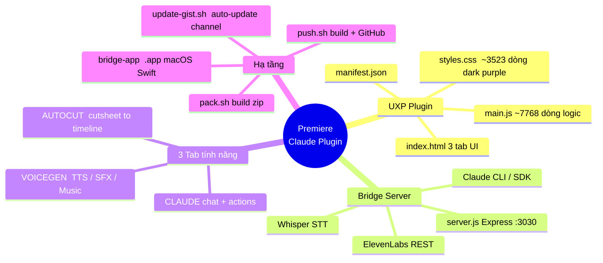
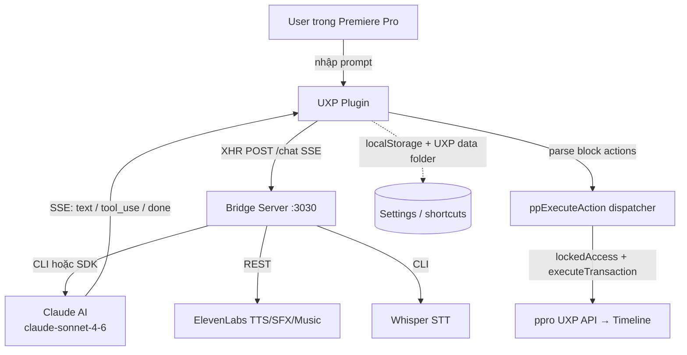
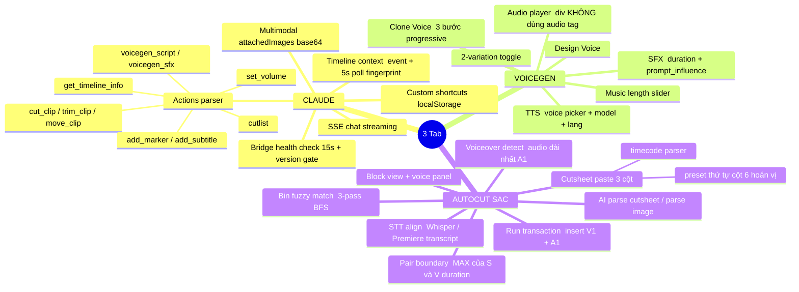
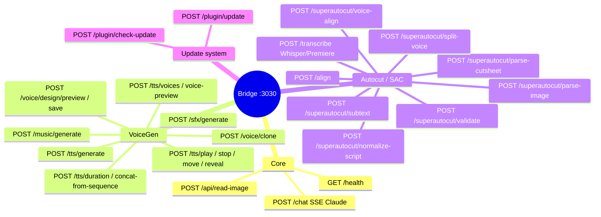
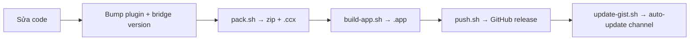

# 🗺️ Premiere Claude Plugin — Project Mindmap

> **Mục đích:** Note context để Claude (và người sau) nạp nhanh bức tranh tổng thể dự án.
> **Đọc kèm:** [[CLAUDE]] (setup), [[BLUEPRINT]] (spec chi tiết), [[ROADMAP]] (việc tiếp), [[CHANGELOG]] (lịch sử fix).

---

## 1. Tổng quan 1 dòng

Plugin **3-in-1** cho Adobe Premiere Pro (UXP) → chat với Claude để edit timeline, tạo giọng đọc ElevenLabs, và tự dựng timeline từ cutsheet (Autocut/SAC). Một **Bridge Server** Node.js local (`:3030`) đứng giữa, gọi Claude CLI / Anthropic SDK + ElevenLabs + Whisper.

---

## 2. Kiến trúc dữ liệu

---

## 3. Ba Tab — chức năng cốt lõi

---

## 4. Bridge Server — endpoints

---

## 5. State toàn cục & cross-tab

| Key | Type | Ghi chú |
|-----|------|---------|
| `BRIDGE_URL` | string | `http://localhost:3030` |
| `CLAUDE_MODEL` | string | `claude-sonnet-4-6` |
| `ANTHROPIC_KEY` | string | rỗng → CLI mode |
| `ELEVENLABS_KEY` | string | quản lý ở tab VoiceGen |
| `messages[]` | array | lịch sử chat |
| `timelineContext` | object | snapshot sequence |
| `attachedImages[]` | array | ảnh đính kèm base64 |
| `isStreaming` | bool | chặn gửi đồng thời |

**Cross-tab bridge (window globals):**
- Claude → Autocut: `window.AutocutSetRows(rows[])`, `window.AutocutPushRows()`
- Claude → VoiceGen: `window.VoiceGenPushScript(text, voiceId, auto)`, `window.VoiceGenPushSFX(text, auto)`
- VoiceGen → Claude: `window.VoiceGenGetVoices()`
- Settings → VoiceGen: `window.VoiceGenOnKeyChange()`

---

## 6. ⚠️ UXP Gotchas (luôn nhớ khi sửa UI)

- ❌ KHÔNG dùng `position:fixed`, `z-index`, `grid`, `new Audio()`.
- ✅ Scroll cần `flex:1` + `min-height:0` + `overflow` trên **INNER child**.
- ⚠️ Native `<input>`/`<select>` luôn vẽ đè → ẩn nền khi mở modal.
- ⚠️ Mọi Premiere API là **async**.
- ⚠️ UXP defer paint của CSS `order` (reflow ≠ repaint) → di chuyển DOM thật bằng `appendChild`, đừng đổi `style.order`.
- Media player: dùng UXP `uxp.storage` path + `HTMLMediaElement`, KHÔNG `new Audio()`.
- Bin traversal: `ppro.FolderItem.cast(item)` trả `null` cho clip/sequence → tránh loop; BFS guard `< 10000`.

> Chi tiết: memory `uxp-known-issues`.

---

## 7. Quy ước release / versioning

- **Luôn bump** version plugin + bridge sau MỖI thay đổi (xem [[feedback_versioning]]).
- Compat gate: plugin hard-code `REQUIRED_BRIDGE` (hiện 1.5.2). TODO: đẩy từ Gist thay vì hard-code.
- ⚠️ Public release zip lộ key → nếu muốn shared ElevenLabs key phải chuyển repo **private**.

---

## 8. Bản đồ memory liên quan (đọc để đầy đủ)

- `project_sac_state` — versions + key API facts + lịch sử fix 4.2.x→4.4.x (memory chính).
- `uxp-known-issues` — toàn bộ gotcha UXP.
- `feedback_bridge_versioning` — quy trình release.
- `feedback_question_vs_implement` — user HỎI thì trả lời, đừng tự implement.
- `project_4b_multispeaker_gen` — multi-speaker voice (deferred).

---

## 9. Hướng phát triển tiếp (từ ROADMAP)

- **SAC:** re-time clip theo voice; chọn FPS sequence mới; dry-run preview + undo batch; bảng tổng hợp source lỗi + "bind tất cả".
- **VoiceGen:** usage/cost meter (token + chi phí); thêm provider/model.
- **Xuất:** SRT/phụ đề từ word-timestamp (đã có hạ tầng whisper align).
- **Update:** compat check 2 chiều plugin↔bridge từ Gist.

---

_Cập nhật note này khi kiến trúc đổi đáng kể. Mermaid `mindmap` + `flowchart` render trong Obsidian (bật Mermaid mặc định)._
